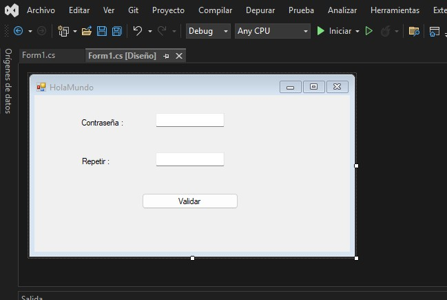

### PROYECTO "HOLA MUNDO"

Este proyecto es una aplicación de Windows Forms que valida contraseñas según los siguientes requisitos:

- La contraseña debe contener al menos una letra mayúscula, 
- Una minúscula. un número y un símbolo.
- El usuario debe ingresar la contraseña dos veces y ambas deben coincidir.

### Funcionamiento principal
------------
En el formulario principal (`Form1`), al hacer clic en el botón, se ejecuta la validación de la contraseña ingresada en `textBox1` y su confirmación en `textBox2`. Si la contraseña cumple con los requisitos y ambas coinciden,
se muestra un mensaje de éxito. Si no, se informa al usuario del error correspondiente.

La validación se realiza mediante una expresión regular y comparaciones simples.

### Se anexa el codigo, comentarios y Evidencia del funcionamiento:

------------

    
	// Importación de librerías
    using System;											//funciones basicas del sistema
    using System.Text.RegularExpressions;	//trabaja con expresiones regulares
    using System.Windows.Forms;				 //crear aplicaciones de Windows Forms
	

------------

    
	// Define el contenedor lógico del proyecto,
	//Aquí se agrupan clases relacionadas 
    namespace WindowsFormsApp1    
    {
        public partial class Form1 : Form
        {
            public Form1()
			

------------

    
	//carga los controles visuales definidos en el diseñador
	//asocia el evento de clic del botón button1 con el método Button1_Click
            {
                InitializeComponent();
                button1.Click += Button1_Click;
            }
    //Evento de carga del formulario
            private void Form1_Load(object sender, EventArgs e)
            {
    

------------

            }
    //Evento de clic del botón, es donde se ejecuta el nucleo de la logica
            private void Button1_Click(object sender, EventArgs e)
            {
                string password = textBox1.Text;				//obtiene el texto Contraseña
                string confirmPassword = textBox2.Text;	//obtiene el segundo texto confirmacion
    
                // Expresión regular: al menos una mayúscula, una minúscula, 
				//un número y un símbolo
                string pattern = @"^(?=.*[A-Z])(?=.*[a-z])(?=.*\d)(?=.*[\W_]).+$";
							// Esta expresion regula lo siguiente
							// Que la contraseña contenga:
							// - Al menos una letra mayúscula ([A-Z])
							// - Al menos una letra minúscula ([a-z])
							// - Al menos un número (\d)
							// - Al menos un símbolo o carácter especial ([\W_])
							
				//valida la contraseña contra el patrón definido
                if (!Regex.IsMatch(password, pattern))
                {
				// Si la contraseña no cumple con el patrón, 
				//muestra un mensaje de error y termina la ejecución del método
                    MessageBox.Show("La contraseña no cumple con los requisitos.");
                    return;
                }
    
				// Verifica si las contraseñas coinciden
                if (password != confirmPassword)
                {
				 // Si las contraseñas no coinciden,
				 //muestra un mensaje de error y termina la ejecución del método
                    MessageBox.Show("Las contraseñas no coinciden.");
                    return;
                }
				// Si la contraseña es válida y las contraseñas coinciden, 
				//muestra un mensaje de éxito
                MessageBox.Show("La contraseña ha sido validada");
            }
        }
    }
    

#### Se anexa imagenes de la ejecucion del codigo :
    

